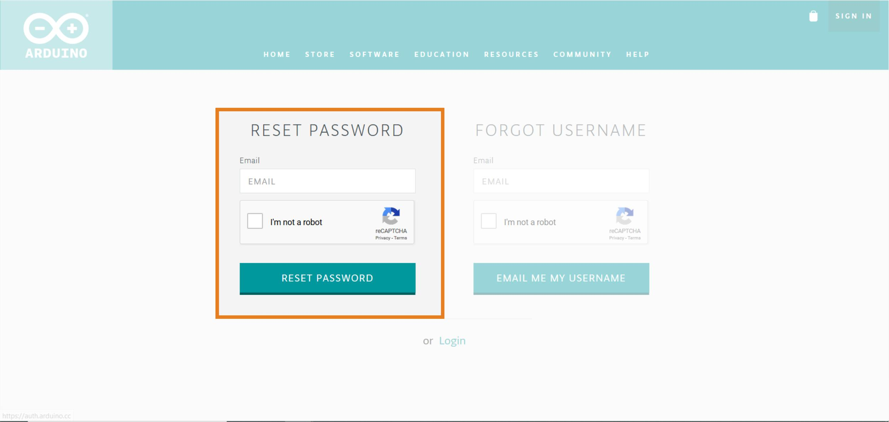

# How can I recover my password or username?

Losing your password or forgetting your username are common situations but are also easy to solve. In the following instruction we will guide you on how to recover the password or your username in case you have used an Arduino username to log in before.

In case you have used the Sign in with Google option, you need to get in contact directly with Google. Also, in case you forgot your password to access the Arduino Chromebook app, please [check this article](link to article).

Ok, let’s begin. First, go to [https://auth.arduino.cc/](https://auth.arduino.cc/)  and click on “Forgot your username/password?”

Type your email in the text fields, to the left in case you have forgotten your password and to the right in case you have forgotten your username. Also, remember to check the box in the captcha and press the button “RESET PASSWORD” or “EMAIL ME MY USERNAME” depending on the case.

After pressing the button you will receive an email with instructions to reset the password. In case you haven’t received the email, check your spam folder.
